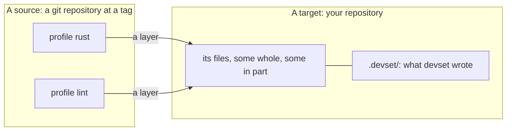

# Introduction

devset applies versioned bundles of files to a directory, records exactly what
it wrote, and updates them later without destroying local edits. This manual
says how to use it: writing profiles, applying them, and keeping a repository up
to date with them.

## Why

A team that keeps more than one repository keeps more than one copy of its
development configuration: formatter settings, lint rules, dependency policy,
editor settings, CI workflows, toolchain pins. The copies are made by hand, and
they drift.

The files nobody edits stay in sync on their own. The files that drift worst
carry content that belongs where it is: a dependency policy holds the team's
licence rules and one repository's own bans; a lint configuration holds the
house rules and the exceptions one codebase needs. That content is not drift,
and a tool that stamps it out is worse than none.

So devset's job is not to make every file identical. It is to share what is
shared, keep what is local, and show the difference.

## How

A **profile** is a directory of files in a **source**: a git repository, or a
local directory. devset applies profiles to a **target**, the directory it
manages, and records the bytes it wrote in the target's `.devset/`. That record
is what lets a later update tell a local edit from a change the profile made.

Profiles compose as crates do. devset is their cargo:

- A target names each source once, and applies profiles from them as **layers**,
  by name: `atxp/rust`.
- A profile **requires** others by name, and offers **features**, which add
  files, requirements and features of what it requires. They unify across the
  target and every requirer, as Cargo's do.
- An entry applies when its **gate** holds: a feature is on, a profile is
  active, a variable has one of some answers, or a file will exist.
- A **scaffold** writes starter files once, when the target has none of its own;
  from then on they are the target's.
- A profile may own only a **part** of a file: some keys of a `Cargo.toml`, or a
  marked block of a `.gitignore`. The rest stays the target's.

And devset keeps them in sync:

- Each file has a **policy**: the profile owns it, the target's edits are merged
  with the profile's, or it is written once and left alone.
- `devset update` moves each source to what its tag or branch names now, merging
  the target's edits with the profile's changes. A merge that fails waits for
  you, and never breaks the working file.
- `devset status --exit-code` fails in CI exactly when a file has drifted from
  what the profile says.

devset never runs code a profile ships. It installs no tools and runs no tasks:
a profile ships a `mise.toml` or a `justfile` for those, as ordinary files. And
it changes one target at a time: to change many repositories at once, run it
from a tool such as [multi-gitter](https://github.com/lindell/multi-gitter).

## Next

[Getting Started](getting-started.md) applies a first profile to a repository;
[A New Rust Project](new-project.md) starts one from a collection's bundle. The
[glossary](glossary.md) holds every word the manual uses.
