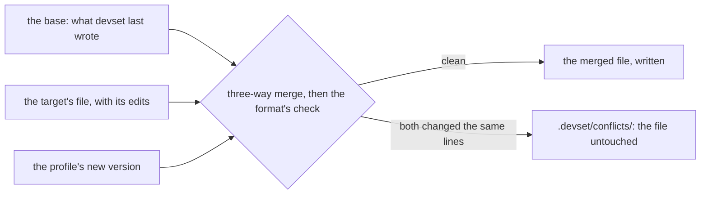

# Updating and Merging

What happens when a profile changes: what an update does to each file, how
devset merges a change with the target's own edits, where a conflict goes, and
what becomes of a file no layer provides any more.
[Update and Resolve Conflicts](resolving.md) is the how-to.

## What an Update Does

For each file whose profile version changed, by its [policy](profiles.md):

| The target's file  | `owned`                         | `merge`           | `once`  |
| ------------------ | ------------------------------- | ----------------- | ------- |
| as devset wrote it | updated                         | updated           | nothing |
| edited             | kept, and reported as drift     | **merged**        | nothing |
| deleted            | the deletion kept, and reported | the deletion kept | nothing |

## Merging



A merge is three-way: the base, which is what devset last wrote and keeps in
`.devset/base/`; the target's version; and the profile's new one. By default a
built-in line merge makes it; a [merge driver](settings.md#merge-drivers) such
as [Mergiraf](https://mergiraf.org) can instead.

**A merged file is checked before it is written.** A line merge can report a
clean merge and still make a broken configuration. Given a local edit near the
top of a file and the profile's edit near its bottom, every line merger produces
this, cleanly:

```yaml
name: app
timeout: 30 # the target's edit
replicas: 1
port: 80
timeout: 60 # the profile's edit: the same key, twice
```

So a merged TOML, JSON or YAML file must parse, with no key twice, or the merge
is a conflict, however cleanly it merged. The format is read from the extension
(`.toml`, `.json` and `.jsonc`, `.yaml` and `.yml`); `validate` on the file's
entry names it, or turns the check off with `none`. JSON is read as JSON with
comments, since so many `.json` configurations have them.

## Conflicts

A change and an edit that touch the same lines conflict. devset writes the
conflict to `.devset/conflicts/<path>`, with conflict markers, and **leaves the
working file untouched**, so a conflict never breaks the build or a formatter;
the run is unfinished until it is resolved and continued, or taken back, as
[Update and Resolve Conflicts](resolving.md#resolving-a-conflict) shows.

What else an update writes while a file conflicts is the target's choice,
`[merge] on-conflict` in [Settings](settings.md):

| `on-conflict`            | The rest of the update                                          |
| ------------------------ | --------------------------------------------------------------- |
| `apply-others` (default) | Written, and the lock moves; the conflicts wait                 |
| `apply-none`             | Withheld until every conflict is resolved, then written at once |

**Some files cannot merge.** A binary file conflicts, and its sidecar holds the
profile's version, to keep or to replace with yours. A file whose base is lost,
as when `.devset/base/` was never committed, merges without one, and always
waits for you.

## Files No Layer Provides

A file no layer provides any more, because a profile dropped it, a layer was
removed, or its [gate](gates.md#when-a-gate-turns-off) turned off, is
**dropped**, and `status` says so, with the condition that decided when a gate
did. The next `apply` takes it away only if it is as devset wrote it:

| The dropped file     | `apply`                                     |
| -------------------- | ------------------------------------------- |
| as devset wrote it   | removes it, and directories it leaves empty |
| edited               | untracks it: the edit is the target's       |
| deleted              | untracks it                                 |
| written under `once` | untracks it: it became the target's         |

A dropped [part](parts.md) leaves its file the same way, its keys or its block
taken out, and a file it leaves empty goes. A key another layer's part now
covers stays, so a key that moves between profiles is never lost.
